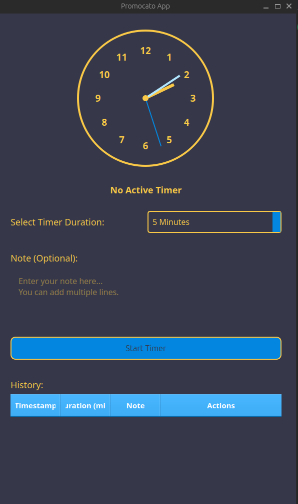
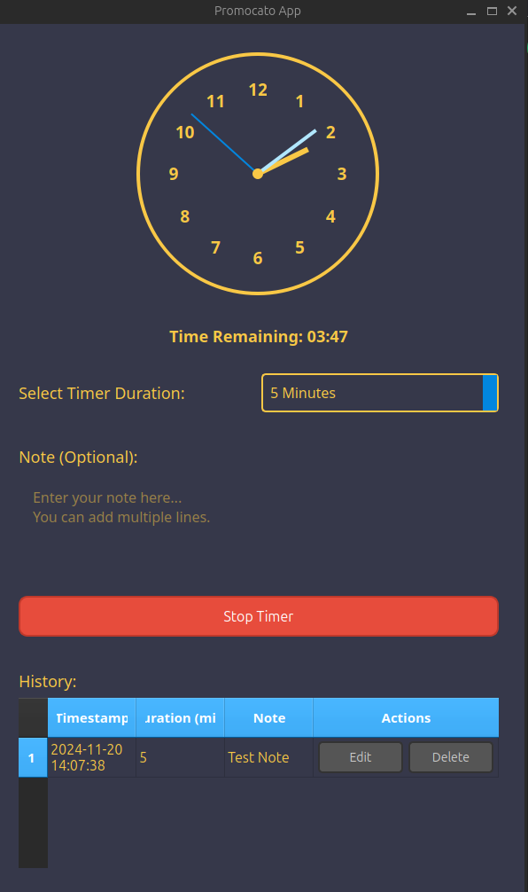

# Create a README.md file for the Promocato App with updated content
readme_content = """
# Promocato App


## Table of Contents

- [Overview](#overview)
- [Features](#features)
- [Demo](#demo)
- [Prerequisites](#prerequisites)
- [Installation](#installation)
  - [Clone the Repository](#clone-the-repository)
  - [Install Dependencies](#install-dependencies)
- [Running the Application](#running-the-application)
  - [Using the Start Script](#using-the-start-script)
  - [Using Docker](#using-docker)
- [Project Structure](#project-structure)
- [Usage](#usage)
- [Customization](#customization)
- [Testing](#testing)
- [Contributing](#contributing)
- [License](#license)
- [Acknowledgements](#acknowledgements)

## Overview

Promocato App is a simple and intuitive timer application built with **Python** and **GTK+3**. Designed to help you manage your time efficiently, it allows you to set timers with predefined durations, add notes for each session, and maintain a history of all your timer activities.

## Features

- **Timer Functionality**
  - Select from predefined durations: 10, 20, 30, or 60 minutes.
  - Start timers with a single click.
  - Receive notifications when timers end.

- **Notes/Memo**
  - Add descriptive notes or memos for each timer session.

- **History Log**
  - View a chronological history of all timer sessions, including duration, notes, and timestamps.

- **User-Friendly Interface**
  - Clean and motivating design with customizable styles.
  - Responsive layout suitable for both Linux and macOS.

- **Cross-Platform Compatibility**
  - Runs seamlessly on both Linux and macOS systems.

## Demo

*Include screenshots or GIFs of your application here to showcase its functionality and design.*


## Prerequisites

Before you begin, ensure you have met the following requirements:

- **Python** (version 3.8 or higher)
  - Check Python version:
    ```bash
    python3 --version
    ```
  - Install Python:
    - **macOS:**
      ```bash
      brew install python
      ```
    - **Linux (Ubuntu/Debian-based):**
      ```bash
      sudo apt update
      sudo apt install python3 python3-pip
      ```

- **Poetry**
  - Install Poetry:
    ```bash
    pip install poetry
    ```

- **GTK+3**
  - Install GTK+3:
    - **macOS:**
      ```bash
      brew install gtk+3
      ```
    - **Linux (Ubuntu/Debian-based):**
      ```bash
      sudo apt install libgtk-3-dev
      ```

- **Docker** (optional, for containerized development)
  - [Install Docker](https://docs.docker.com/get-docker/)

## Installation

### Clone the Repository

```bash
git clone https://github.com/yourusername/promocato_app.git
cd promocato_app
```
## Screenshot

Here is a preview of the application:



